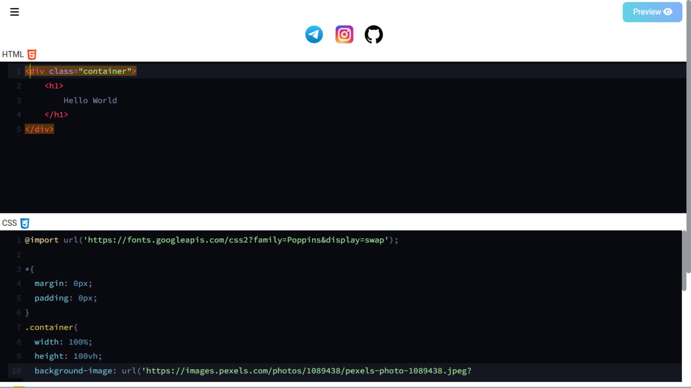
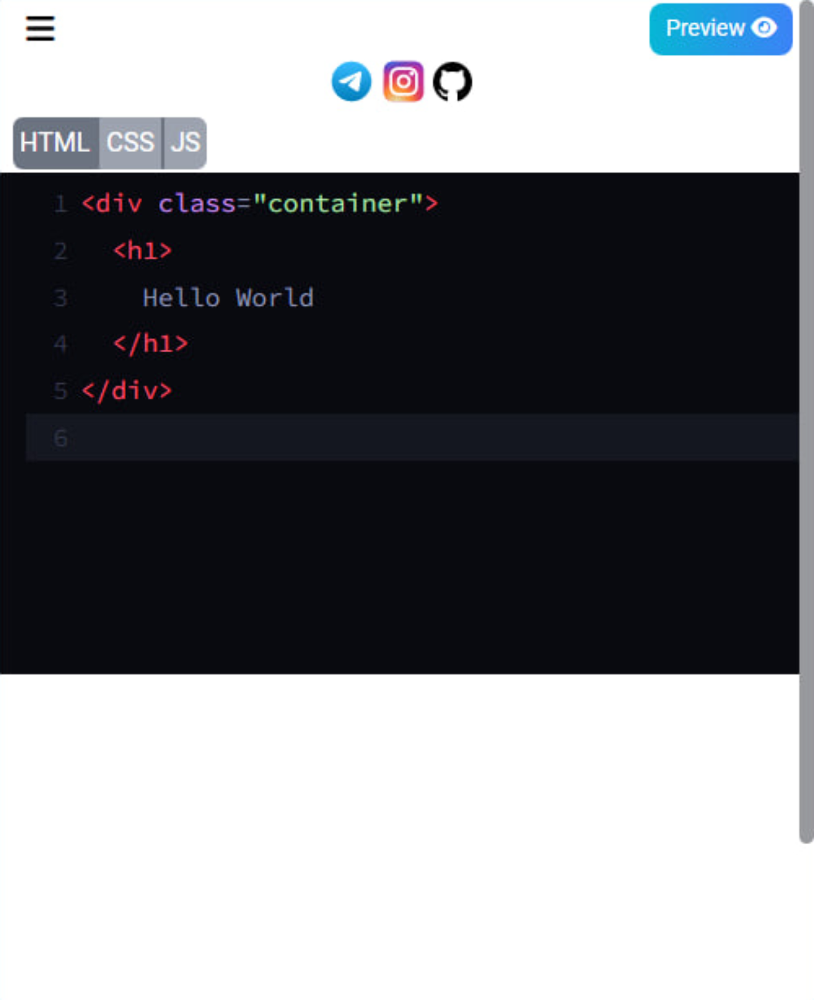
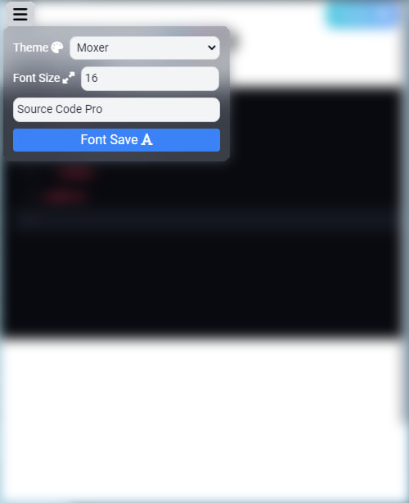

# CodeMirror [Link](https://ngx-codemirror-bek.vercel.app/)

## Desktop 💻


## Mobile 📱


***

## Informations ℹ️

### Themes 🌈
* **3024-Day**
* **3024-Night**
* **Abbott**
* **Abcdef**
* **Ambiance**
* **Ambiance-Mobile**
* **Ayu-Dark**
* **Ayu-Mirage**
* **Base16-Dark**
* **Base16-Light**
* **Bespin**
* **Blackboard**
* **Cobalt**
* **Colorforth**
* **Darcula**
* **Dracula**
* **Duotone-Dark**
* **Duotone-Light**
* **Eclipse**
* **Elegant**
* **Erlang-Dark**
* **Gruvbox-Dark**
* **Hopscotch**
* **Icecoder**
* **Idea**
* **Isotope**
* **Juejin**
* **Lesser-Dark**
* **Liquibyte**
* **Lucario**
* **Material**
* **Material-Darker**
* **Material-Ocean**
* **Material-Palenight**
* **Mbo**
* **Mdn-Like**
* **Midnight**
* **Monokai**
* **Moxer**
* **Neat**
* **Neo**
* **Night**
* **Nord**
* **Oceanic-Next**
* **Panda-Syntax**
* **Paraiso-Dark**
* **Paraiso-Light**
* **Pastel-On-Dark**
* **Railscasts**
* **Rubyblue**
* **Seti**
* **Shadowfox**
* **Solarized**
* **Ssms**
* **The-Matrix**
* **Tomorrow-Night-Bright**
* **Tomorrow-Night-Eighties**
* **Ttcn**
* **Twilight**
* **Vibrant-Ink**
* **Xq-Dark**
* **Xq-Light**
* **Yeti**
* **Yonce**
* **Zenburn**

### Keyboard Functions ⌨️
1. `Ctrl-Space` - Autocomplete
2. `Ctrl-J` - To Matching Tag
3. `Alt-F` - Find Persistent

### Additional Amenities 🌟

```js
lineNumbers: true,
autofocus: true,
lineWrapping: true,
autoCloseBrackets: true,
autoCloseTags: true,
styleActiveLine: true,
gutters: ["CodeMirror-lint-markers"],
lint: true,
matchTags: { bothTags: true },
```

**Menu**



**Through this menu you can change the code editor `theme` `font-size` `font-family`**

***

## Example

**HTML**
```html
<div class="container">
    <h1>
        Hello World
    </h1>
</div>
```

**CSS**
```css
@import url('https://fonts.googleapis.com/css2?family=Poppins&display=swap');

*{
  margin: 0px;
  padding: 0px;
}
.container{
  width: 100%;
  height: 100vh;
  background-image: url('https://images.pexels.com/photos/1089438/pexels-photo-1089438.jpeg?auto=compress&cs=tinysrgb&w=1260&h=750&dpr=1');
  background-repeat: no-repeat;
  background-size: cover;
  background-position: center;
  display: flex;
  justify-content: center;
  align-items: center;
}
.container h1{
  color: white;
  font-family: Poppins, sans-serif;
  padding: 50px;
  border: 1px solid rgba(255, 255, 255, .4);
  border-radius: 7px;
  backdrop-filter: blur(7px);
}
```

### Result


